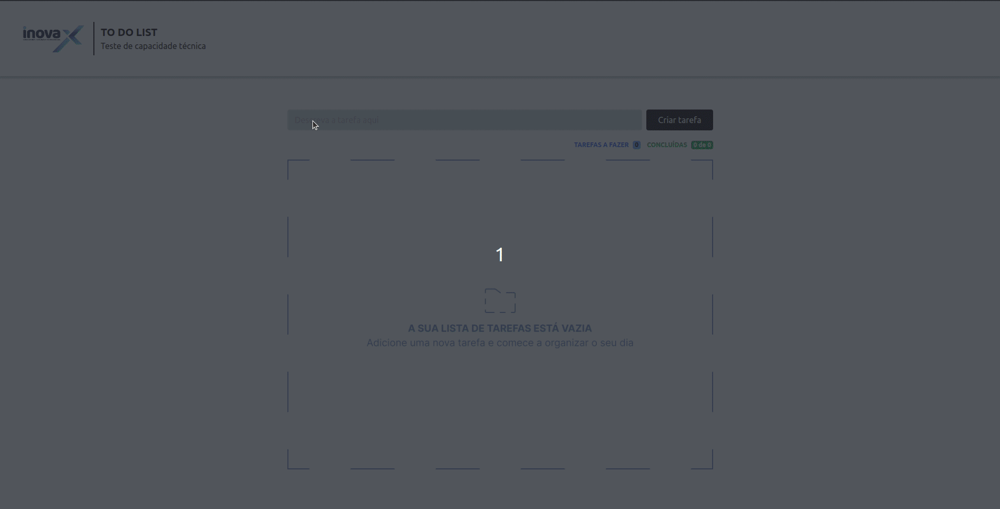

#  ToDo List

Esse projeto consiste em uma simples lista de tarefas a serem realizadas, desenvolvida com React.js.

## Demonstração

<p aling="center">
  
</p>

## Rodando localmente

Clone o projeto

1. Clone o projeto

```bash
  git clone git@github.com:JonasTiago/toDo-list-inovax.git
```

2. Entre no diretório do projeto

```bash
  cd toDo-list-inovax
```

3. Instale as dependências

```bash
  npm install
```

4. Inicie o app

```bash
  npm run dev
```
